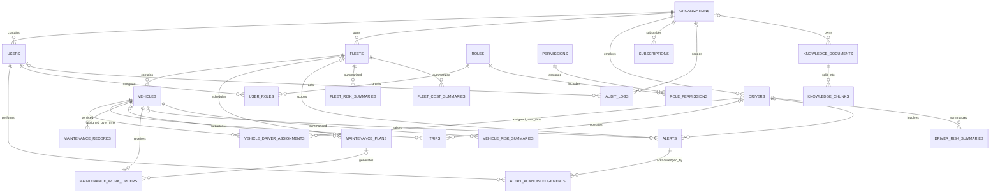

# FleetGuard AI Database Design

## Scope and ownership

This is the Phase 2 persistence layer. It follows [ARCHITECTURE.md](../architecture/ARCHITECTURE.md), [DATA_FLOW.md](../architecture/DATA_FLOW.md), and [SERVICE_BOUNDARIES.md](../architecture/SERVICE_BOUNDARIES.md). PostgreSQL owns transactional/business truth, MongoDB owns flexible telemetry and diagnostics, Redis is an expiring hot-state cache, PostgreSQL's pgvector extension holds future retrieval data, and S3-compatible object storage is the intended historical Parquet store. This phase does not implement MQTT/Kafka ingestion, Flink jobs, model inference/training, browser features, or an AI agent.

The repository already used PostgreSQL, MongoDB, Redis, and an S3-compatible endpoint. Phase 1 substituted SeaweedFS 4.48 for the architecture's MinIO because MinIO's public image and binary registries were unavailable. Phase 2 retains that existing endpoint and persists Parquet objects through its S3 API; it does not silently switch storage products.

## PostgreSQL

PostgreSQL 16 with pgvector is the transactional system of record. Objects live in the `fleetguard` schema and use UUID primary keys generated by PostgreSQL (`gen_random_uuid()`) with matching Python-side UUID defaults. Timestamps are timezone-aware UTC values. Mutable business records have `created_at` and `updated_at`; immutable event/snapshot records have `created_at` or `occurred_at` as appropriate.

The normalized schema has 24 tables:

| Domain | Tables | Purpose |
| --- | --- | --- |
| Organization and authorization | `organizations`, `users`, `roles`, `permissions`, `user_roles`, `role_permissions`, `subscriptions` | Tenant identity, grants, and subscription state. Permissions are global stable codes; role assignments are organization-scoped. |
| Fleet operations | `fleets`, `vehicles`, `drivers`, `vehicle_driver_assignments`, `trips` | Fleet membership and historical driver assignment, without putting telemetry or a current driver foreign key on a vehicle. |
| Maintenance | `maintenance_plans`, `maintenance_records`, `maintenance_work_orders` | Planned intervals, service history, and work-order lifecycle. |
| Alerts | `alerts`, `alert_acknowledgements` | Current alert state plus append-only acknowledgement history. |
| Summaries | `vehicle_risk_summaries`, `driver_risk_summaries`, `fleet_risk_summaries`, `fleet_cost_summaries` | Time-windowed projections, not raw telemetry. Risk scores are nullable and seeded as `unknown`. |
| Audit | `audit_logs` | Actor, tenant, action, resource, time, request ID, IP, result, and non-secret metadata. |
| Retrieval preparation | `knowledge_documents`, `knowledge_chunks` | Source documents and chunk embeddings for future RAG; no agent is implemented. |

Tenant-owned rows carry `organization_id`. Composite foreign keys include that tenant key when linking vehicles, fleets, drivers, users, roles, alerts, work orders, and summaries. This prevents a valid ID from another organization being linked accidentally. Repository methods also require an organization ID for tenant-scoped reads. The schema is approximately 3NF; JSONB is limited to genuinely flexible service/OEM/audit/risk metadata. Intentional summary denormalization stores aggregate windows and counts so dashboards do not scan raw events.

### ER model



`vehicles` stores VIN, fleet, make/model/year, type, powertrain, fuel/battery capacity, status, and timestamps; telemetry history is never stored there. `vehicle_driver_assignments` preserves assignment history, allows one active assignment per vehicle and driver, and indexes vehicle/driver plus descending start time. Trips store endpoints, times, distance, energy/fuel use, and status but no raw points. Maintenance and alert models use checks for valid status, ranges, dates, and severities. Alert events retain `event_at`, acknowledgment and resolution times, and metadata; acknowledgements are separately historical.

### Index rationale

Indexes are defined in the initial Alembic revision and correspond to repository access patterns:

- `vehicles(organization_id, fleet_id)` and `(organization_id, status)` support fleet lists and status filters; a lower-cased organization/email unique index supports case-insensitive user lookup.
- `drivers(organization_id, status)` and fleet status indexes support administrative lists.
- Partial unique assignment indexes on `(organization_id, vehicle_id)` and `(organization_id, driver_id)` where `ends_at IS NULL` enforce one current assignment while retaining history; descending-start indexes support history reads.
- Trips and maintenance records use `(organization_id, entity_id, timestamp DESC)` for vehicle/driver history.
- Alerts index vehicle history, organization/fleet + status/severity, and recent organization alerts.
- Risk/cost summaries use organization/entity + window end descending to retrieve the latest summary.
- Audit indexes support tenant-time, resource-time, and request-ID lookups.
- Knowledge chunks have document/order lookup and a cosine HNSW index; HNSW is for future semantic retrieval, not telemetry.

### pgvector dimension

`PGVECTOR_EMBEDDING_DIMENSION` defaults to 1536 and is read by the ORM configuration. No embedding model is selected in this phase. The initial migration is pinned to `vector(1536)` so migrations are deterministic. A different dimension requires changing the setting and adding a schema migration that replaces the vector column and HNSW index together; changing only `.env` after migration is unsupported. The configured dimension is constrained to pgvector's supported indexed range (1–2000).

## MongoDB

The logical database is `fleetguard`. Collections:

| Collection | Contents | Indexes |
| --- | --- | --- |
| `telemetry_events` | Canonical telemetry plus DTC list and `oem_metadata` | `_id=event_id` for duplicate suppression; `vehicle_id + event_ts DESC`; `event_type + event_ts DESC`; `vehicle_id + event_type + event_ts DESC` |
| `diagnostic_events` | Diagnostic code, severity/description, event and ingestion timestamps, OEM payload | `vehicle_id + event_ts DESC`; `code + event_ts DESC` |
| `vehicle_state` | Latest operational snapshot projection | Unique `vehicle_id` |

Telemetry carries `organization_id`, `vehicle_id`, optional VIN, event/ingest timestamps, sequence, schema version, type, location, speed, acceleration, battery/fuel, odometer, DTCs, and flexible OEM metadata. Timestamps must include a timezone and are normalized to UTC. Ordering is not assumed: events are retained with event time and ingestion time, queried by vehicle/time, and ordered by event time. A repeated `event_id` returns `False` from the repository rather than inserting a second record. MongoDB schema validators reject malformed canonical envelopes while allowing OEM details inside the explicitly semi-structured object.

The current indexes intentionally avoid high-cardinality over-indexing on every telemetry field. Event IDs are the authoritative duplicate identity; the schema retains sequence numbers for future ordering checks. Historical retention and archival scheduling are not automated yet.

## Redis

Redis is a password-protected, append-only local cache; it is not source of truth. Application cache writes require a positive TTL:

| Key | Type | TTL | Update/owner |
| --- | --- | --- | --- |
| `vehicle:{id}:latest` | JSON string | 300 s | State projection writer replaces latest snapshot |
| `vehicle:{id}:location` | JSON string | 120 s | Location projection writer replaces latest point |
| `vehicle:{id}:risk` | JSON string | 900 s | Risk projection writer; summary remains in PostgreSQL |
| `driver:{id}:score` | JSON string | 900 s | Driver-score projection writer; summary remains in PostgreSQL |
| `vehicle:{id}:alerts` | Set of alert IDs | 24 h | Alert projection adds IDs; lifecycle owner removes/resyncs them |
| `fleet:{id}:summary` | JSON string | 30 s | Dashboard projection replaces aggregate |

These keys are rebuildable from PostgreSQL/MongoDB/event history. The cache adapter supports connection injection for tests and uses one pooled client in the API process.

## Parquet and object storage

The architecture specifies MinIO locally; Phase 1 established SeaweedFS as its S3-compatible local substitute. `write_telemetry_batch()` serializes validated telemetry to Parquet with Zstandard compression and writes to the configured S3 endpoint/bucket. One object is emitted per date/hour/organization batch, avoiding vehicle-level partitions and excessive small partitions:

```text
raw/event_date=YYYY-MM-DD/hour=HH/organization_id=<uuid>/telemetry-<uuid>.parquet
```

The Parquet schema includes event ID, organization/vehicle/VIN, event and ingest timestamps, sequence/schema version, event type, location/motion, battery/fuel/odometer, DTC list, and JSON-serialized OEM metadata. `clean/` and `curated/` remain planned architecture layers; this phase writes only the raw layer and does not run a Kafka writer, compactor, or batch analytics. Retention, compaction, encryption policy, and legal-hold lifecycle need an operational policy before production.

## Migrations, initialization, and roles

Alembic revisions live in `services/api/migrations/versions`. `database-init` waits for PostgreSQL/MongoDB health, then:

1. Connects with admin credentials to create/update a PostgreSQL migration owner and a distinct runtime role.
2. Enables `vector`, creates/owns the `fleetguard` schema, and grants the runtime role only schema usage, DML, and sequence usage (including default privileges for migrated tables).
3. Creates a MongoDB application user scoped to the FleetGuard database with `readWrite`, then applies validators and indexes.
4. Runs `alembic upgrade head` using the migration-only URL.
5. Runs deterministic seed data using the runtime URL.

The API receives only runtime PostgreSQL/Mongo credentials, Redis URL, and object-storage credentials. Admin and migration URLs are not passed to the API container. Schema setup is idempotent. Migration downgrade drops application tables in reverse dependency order; extension and schema ownership are retained for re-upgrade.

From the repository root:

```powershell
python scripts/dev.py up
python scripts/dev.py migrate
python scripts/dev.py seed 100
```

The normal `up` command runs initialization and seed automatically. The seed count can be set in `.env` using `SEED_VEHICLE_COUNT` (1–10,000) or overridden by `seed <count>`. UUIDv5 IDs and a fixed development organization make seed output reproducible. Seeding skips if the development organization already exists; change the count before first initialization or recreate the development database to reseed a different quantity. Seed records use synthetic `.test` identities and explicitly unscored risk/cost summaries.

## Environment variables

`.env.example` contains variable names and non-secret defaults only. `scripts/dev.py up` generates local random values for database admin/runtime/migration users and passwords, Mongo root/app users and passwords, Redis password, object-store keys, and Grafana admin credentials. It derives URL-escaped DSNs and writes ignored `.env`. Do not put production credentials in this file.

Important settings: `DATABASE_URL`, `DATABASE_MIGRATION_URL`, `DATABASE_ADMIN_URL`, `POSTGRES_APP_USER/PASSWORD`, `POSTGRES_MIGRATION_USER/PASSWORD`, `MONGODB_URL`, `MONGODB_ADMIN_URL`, `MONGODB_DATABASE`, `MONGODB_APP_USER/PASSWORD`, `REDIS_URL`, `REDIS_PASSWORD`, `PGVECTOR_EMBEDDING_DIMENSION`, `OBJECT_STORAGE_ENDPOINT/ACCESS_KEY/SECRET_KEY/BUCKET`, and `SEED_DATA_ENABLED/SEED_VEHICLE_COUNT`.

## Representative queries

The repository bounds list sizes and uses parameterized SQLAlchemy expressions. Tenant ID is always part of business reads.

1. **List vehicles in a fleet (keyset by UUID):**

```sql
SELECT id, vin, make, model, model_year, vehicle_type, powertrain_type, status
FROM fleetguard.vehicles
WHERE organization_id = :organization_id
  AND fleet_id = :fleet_id
  AND (:after_id IS NULL OR id > :after_id)
ORDER BY id
LIMIT :limit;
```

2. **Get vehicle details:**

```sql
SELECT id, fleet_id, vin, make, model, model_year, vehicle_type,
       powertrain_type, fuel_type, battery_capacity_kwh, status, created_at, updated_at
FROM fleetguard.vehicles
WHERE organization_id = :organization_id AND id = :vehicle_id;
```

3. **Vehicle maintenance history:**

```sql
SELECT id, maintenance_type, service_at, due_at, description, odometer_km,
       cost, currency, service_provider, status
FROM fleetguard.maintenance_records
WHERE organization_id = :organization_id AND vehicle_id = :vehicle_id
ORDER BY service_at DESC NULLS LAST, id DESC
LIMIT :limit;
```

4. **Vehicle alerts:**

```sql
SELECT id, alert_type, severity, status, message, event_at, acknowledged_at, resolved_at
FROM fleetguard.alerts
WHERE organization_id = :organization_id AND vehicle_id = :vehicle_id
ORDER BY created_at DESC, id DESC
LIMIT :limit;
```

5. **Latest high-risk vehicle summaries:**

```sql
WITH latest AS (
  SELECT vehicle_id, window_end, score, risk_level, model_version,
         row_number() OVER (
           PARTITION BY organization_id, vehicle_id
           ORDER BY window_end DESC, id DESC
         ) AS risk_rank
  FROM fleetguard.vehicle_risk_summaries
  WHERE organization_id = :organization_id
)
SELECT vehicle_id, window_end, score, risk_level, model_version
FROM latest
WHERE risk_rank = 1 AND risk_level IN ('high', 'critical')
ORDER BY score DESC NULLS LAST, vehicle_id
LIMIT :limit;
```

Do not classify an `unknown` or null score as low risk.

6. **Fleet summary without join multiplication:**

```sql
WITH vehicles AS (
  SELECT count(*) AS active_vehicle_count
  FROM fleetguard.vehicles
  WHERE organization_id = :organization_id AND fleet_id = :fleet_id AND status = 'active'
), alerts AS (
  SELECT count(*) AS active_alert_count
  FROM fleetguard.alerts
  WHERE organization_id = :organization_id AND fleet_id = :fleet_id AND status = 'active'
)
SELECT vehicles.active_vehicle_count, alerts.active_alert_count
FROM vehicles CROSS JOIN alerts;
```

7. **Latest driver risk:**

```sql
SELECT window_start, window_end, score, risk_level, model_name, model_version, calculated_at
FROM fleetguard.driver_risk_summaries
WHERE organization_id = :organization_id AND driver_id = :driver_id
ORDER BY window_end DESC
LIMIT 1;
```

8. **Recent alerts with stable keyset cursor:**

```sql
SELECT id, fleet_id, vehicle_id, alert_type, severity, status, message, created_at
FROM fleetguard.alerts
WHERE organization_id = :organization_id
  AND status = :status
  AND (created_at, id) < (:cursor_created_at, :cursor_id)
ORDER BY created_at DESC, id DESC
LIMIT :limit;
```

9. **Vehicle trips with stable keyset cursor:**

```sql
SELECT id, driver_id, started_at, ended_at, distance_km, fuel_used_l, energy_used_kwh, status
FROM fleetguard.trips
WHERE organization_id = :organization_id
  AND vehicle_id = :vehicle_id
  AND (started_at, id) < (:cursor_started_at, :cursor_id)
ORDER BY started_at DESC, id DESC
LIMIT :limit;
```

10. **Audit history:**

```sql
SELECT id, actor_user_id, action, resource_type, resource_id, occurred_at, request_id, result
FROM fleetguard.audit_logs
WHERE organization_id = :organization_id
  AND (occurred_at, id) < (:cursor_occurred_at, :cursor_id)
ORDER BY occurred_at DESC, id DESC
LIMIT :limit;
```

### EXPLAIN ANALYZE examples

Run against a representative dataset; no execution times or plan claims are included because no benchmark was performed:

```sql
EXPLAIN (ANALYZE, BUFFERS)
SELECT id, vin, status
FROM fleetguard.vehicles
WHERE organization_id = :organization_id AND fleet_id = :fleet_id
ORDER BY id
LIMIT 100;

EXPLAIN (ANALYZE, BUFFERS)
SELECT id, severity, status, created_at
FROM fleetguard.alerts
WHERE organization_id = :organization_id AND status = 'active' AND severity = 'critical'
ORDER BY created_at DESC, id DESC
LIMIT 100;

EXPLAIN (ANALYZE, BUFFERS)
SELECT chunk.id, chunk.content
FROM fleetguard.knowledge_chunks AS chunk
WHERE chunk.embedding IS NOT NULL
ORDER BY chunk.embedding <=> :query_embedding::vector
LIMIT 10;
```

The intended access paths are the fleet/status vehicle indexes, the tenant/fleet/status/severity alert index, and the cosine HNSW index, respectively. Verify actual plans after loading representative data; selectivity, table size, and statistics determine whether PostgreSQL uses each index.

## Testing

`tests/requirements.txt` installs the API package and Testcontainers. Database integration tests use pinned PostgreSQL/pgvector, MongoDB, and Redis images, create isolated instances, apply Alembic from an empty database, and tear them down. They cover migration upgrade/downgrade, table/index/extension creation, constraints, CRUD, transaction rollback, pagination, seed behavior, vector storage/query, telemetry validation/dedup/time windows, and Redis TTL/key behavior.

```powershell
python -m pip install -r tests/requirements.txt
python -m pytest -q
```

The Phase 1 Docker Compose stack is also verified using `python scripts/dev.py up` and `python scripts/dev.py verify`; the latter checks all container health states and database/broker/object-store connectivity. Tests require a working Docker daemon and image-registry access.

## Known limitations

- No telemetry ingestion, stream processor job, authentication provider, public business API endpoints, ML model, or RAG agent is implemented in Phase 2.
- PostgreSQL and MongoDB application credentials are separated from admin credentials, but local traffic is plaintext on a private Docker network; production TLS/secrets management is still required.
- The local MongoDB deployment is a single node, not a replica set. Redis is a single authenticated instance without per-user ACLs.
- Summary tables are schemas only; this phase does not calculate scores, costs, or aggregates. Unknown/null values mean no calculation has occurred.
- Parquet output is a utility only; no Kafka writer, compactor, retention scheduler, or batch analytics is running.
- SeaweedFS is the documented S3-compatible local substitute for the unavailable MinIO distribution; production cloud selection is unchanged.
- A database initialized with one embedding dimension requires an explicit migration to change that vector typmod and index.
